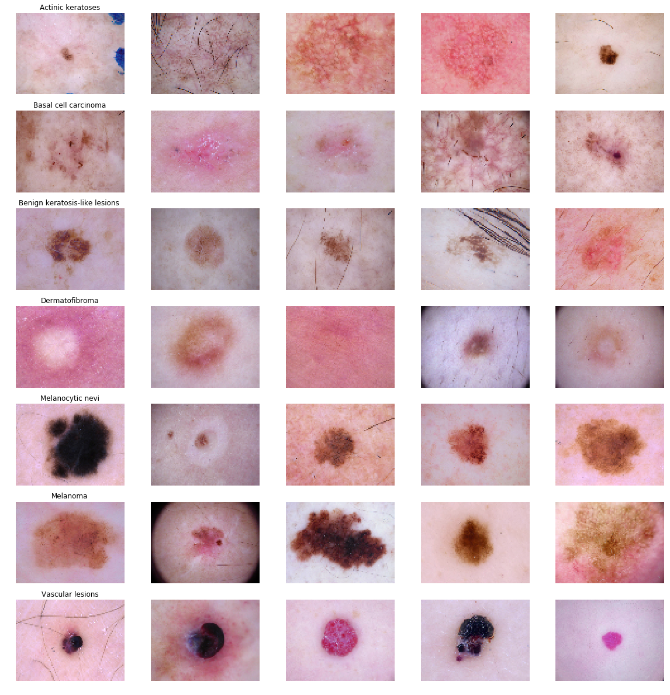
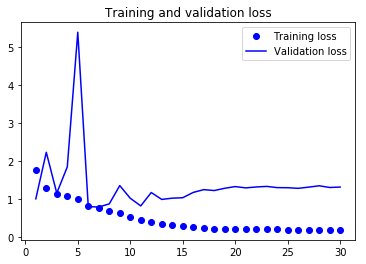
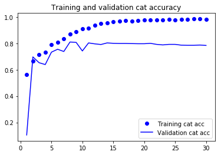
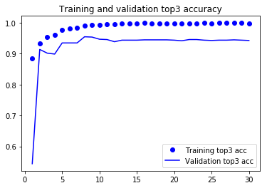
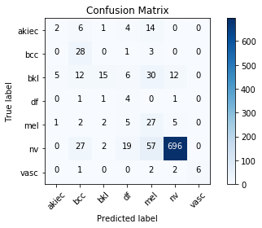

## Nevus Tester

# Overview

The HAM10000 dataset is composed of 10.015 dermatoscopic images of pigmented skin lesions. This dataset is pubicly available at [Harvard Dataverse](https://dataverse.harvard.edu/dataset.xhtml?persistentId=doi:10.7910/DVN/DBW86T). 
Cases include a representative collection of all important diagnostic categories in the realm of pigmented lesions: Actinic keratoses and intraepithelial carcinoma / Bowen's disease (akiec), basal cell carcinoma (bcc), benign keratosis-like lesions (solar lentigines / seborrheic keratoses and lichen-planus like keratoses, bkl), dermatofibroma (df), melanoma (mel), melanocytic nevi (nv) and vascular lesions (angiomas, angiokeratomas, pyogenic granulomas and hemorrhage, vasc).

More than 50% of lesions are confirmed through histopathology (histo), the ground truth for the rest of the cases is either follow-up examination (follow_up), expert consensus (consensus), or confirmation by in-vivo confocal microscopy (confocal). The dataset includes lesions with multiple images, which can be tracked by the lesion_id-column within the HAM10000_metadata file.

<hr>

# How to Run This Project

</img>


Clone the repositiory to your local machine.

``` Batchfile
git clone https://github.com/shlvd/Nevus_tester
```

Open [nevus_tester.html](nevus_tester.html) in Microsoft Edge browser </img> (it may not work correctly in other browsers!)

Select model from list (MobileNet or MobileNet_v2 at the moment)

Upload an image of nevus and click Predict button (it may take up to 10 seconds to see prediction for the first time)

<hr>

# How to Train the model

# 1. Setup Instructions and Dependencies

Clone the repositiory to your local machine and go to 'train_model' directory.

``` Batchfile
git clone https://github.com/shlvd/Nevus_tester
```

Start a virtual environment using python3
``` Batchfile
virtualenv env
env/Scripts/activate.bat
```


Install the dependencies
``` Batchfile
pip install -r requirements.txt
```

# 2. Dataset

The dataset is available to download from the official site [here](https://dataverse.harvard.edu/dataset.xhtml?persistentId=doi:10.7910/DVN/DBW86T). Download and extract the dataset to `input/skin-cancer-mnist-ham10000` folder in the same directory.

#### Sample



# 3. Training the model

To train the model, run

```Batchfile
python main.py --train=True
```

optional arguments:
  | argument | default | desciption|
  | --- | --- | --- |
  | -h, --help | | show help message and exit |
  | --use_cuda | False | device to train on. default is CPU |
  | --samples | False | See sample images |
  | --view_data_counts | False | Visualize data distribution |
  | --num_epochs | 10 | Number of epochs to train on |
  | --train | True | train the model |

# 4. Observations

### Accuracy and Loss





### Confusion Matrix

