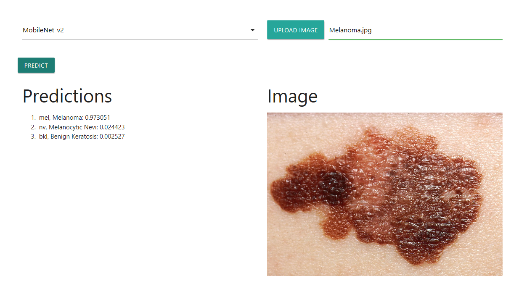

## Nevus Tester

# Overview

The HAM10000 dataset is composed of 10.015 dermatoscopic images of pigmented skin lesions. This dataset is pubicly available at https://dataverse.harvard.edu/dataset.xhtml?persistentId=doi:10.7910/DVN/DBW86T. 
Cases include a representative collection of all important diagnostic categories in the realm of pigmented lesions: Actinic keratoses and intraepithelial carcinoma / Bowen's disease (akiec), basal cell carcinoma (bcc), benign keratosis-like lesions (solar lentigines / seborrheic keratoses and lichen-planus like keratoses, bkl), dermatofibroma (df), melanoma (mel), melanocytic nevi (nv) and vascular lesions (angiomas, angiokeratomas, pyogenic granulomas and hemorrhage, vasc).

More than 50% of lesions are confirmed through histopathology (histo), the ground truth for the rest of the cases is either follow-up examination (follow_up), expert consensus (consensus), or confirmation by in-vivo confocal microscopy (confocal). The dataset includes lesions with multiple images, which can be tracked by the lesion_id-column within the HAM10000_metadata file.

<hr>

<b>How to Run This Project</b>
<br>

</img>

<br>

Clone the repositiory to your local machine.

``` Batchfile
https://github.com/shlvd/Nevus_tester.git
```

Open nevus_tester.html in Microsoft Edge browser </img>(it may not work correctly in other browsers!)

Select model from list (MobileNet or MobileNet_v2 at the moment)

Upload an image of nevus and click Predict button (it may take up to 10 seconds to see prediction for the first time)
